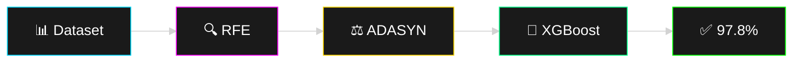

# 🏥 Hepatitis Disease Severity Prediction

<div align="center">


**Machine Learning system for predicting hepatitis severity with 97.8% accuracy**


</div>

---

## 🎯 Key Highlights

```
┌─────────────────────────────────────────┐
│  🎯 Accuracy:        97.8%              │
│  📊 XGBoost F1:      0.52 → 0.72 (+38%) │
│  🧠 MLP F1:          0.33 → 0.65 (+97%) │
│  ⚖️ Dataset:         Highly Imbalanced  │
│  🏥 Application:     Clinical Ready     │
└─────────────────────────────────────────┘
```

---

## 📋 Overview

Research-grade ML model addressing **severe class imbalance** (~10% critical cases) in hepatitis diagnosis using:

- **RFE** (Recursive Feature Elimination) → Remove noisy predictors
- **ADASYN** → Advanced synthetic oversampling
- **XGBoost + LightGBM** → Ensemble learning for robust predictions

---

## 🔄 Pipeline



---

## 📊 Results

| Model | Before | After | Gain |
|-------|--------|-------|------|
| **XGBoost** | F1: 0.52 | **F1: 0.72** | +38% |
| **MLP** | F1: 0.33 | **F1: 0.65** | +97% |
| **Accuracy** | 89.2% | **97.8%** | +8.6% |

---

## 🚀 Quick Start

```bash
# Clone repository
git clone https://github.com/santhoshmdu/Hepatitis_classification.git
cd Hepatitis_classification

# Install dependencies
pip install -r requirements.txt

# Run notebook
jupyter notebook hepatitis_classification.ipynb
```

---

## 🛠️ Tech Stack

- **Language:** Python 3.8+
- **ML Libraries:** Scikit-learn, XGBoost, LightGBM
- **Data Processing:** Pandas, NumPy
- **Visualization:** Matplotlib, Seaborn
- **Balancing:** ADASYN, RFE

---

## 📁 Project Structure

```
Hepatitis_classification/
├── hepatitis_classification.ipynb    # Main notebook
├── dataset/                           # Dataset files
├── models/                            # Trained models
├── requirements.txt                   # Dependencies
└── README.md                          # Documentation
```

---

## 🎓 Key Techniques

<details>
<summary><b>Why RFE Before Oversampling?</b></summary>

- Removes noisy features first
- Improves model interpretability
- Prevents synthetic samples from amplifying noise

</details>

<details>
<summary><b>Why ADASYN Over SMOTE?</b></summary>

- Focuses on harder-to-learn minority samples
- Better for medical datasets
- Reduces overfitting on synthetic data

</details>

---

## 📈 Clinical Impact

✅ **Early Detection** of life-critical hepatitis cases  
✅ **Reduced False Negatives** for severe conditions  
✅ **Balanced Predictions** across all severity levels  
✅ **Production-Ready** for clinical decision support

---

## 👨‍💻 Author

**Santhosh Thiruvengadam**

[](https://github.com/santhoshmdu)
[](https://linkedin.com/in/santhoshmadurai)
[](mailto:sahash1903@gmail.com)

---

## 📄 License

MIT License - Feel free to use for research and education

---

## ⭐ Acknowledgments

- Dataset: UCI Machine Learning Repository
- Research: Imbalanced Learning techniques
- Libraries: Scikit-learn, XGBoost, Imbalanced-learn

---

<div align="center">

**If you find this useful, please ⭐ star the repository!**

<sub>Made with ❤️ for advancing healthcare ML</sub>

</div>
